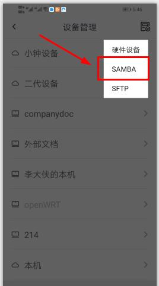
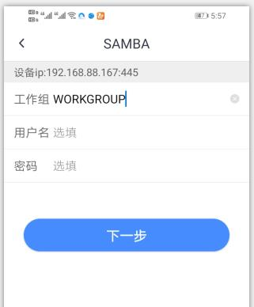

# 如何用易有云连接SAMBA？
<blockquote>

SAMBA协议绑定的设备均为虚拟设备，除文件管理外，其他功能均不可用；

</blockquote>

**1.登录APP，点击“我的-设备管理”，进入设备列表页面。点击右上角添加设备图标，选择SAMBA；**

**2.选择关联设备，设备IP为选填项（可选择也可手动输入），建议选择IP，这样数据更准确。端口默认为445，可更改。点击下一步；**
<blockquote>
出于数据安全考虑，连接SAMBA数据只存在本地，绑定后，请使用本机（当时绑定设备的终端）上的易有云客户端访问；如您更换终端设备，请重新绑定 
关联设备后，绑定成功后，即可在外网通过该关联设备访问我的共享文件，如不关联设备，只能在本机现在的局域网内访问该文件；

</blockquote>
关联设备：

不关联设备：

**3.填写工作组，我的win10电脑用户名和密码，点击下一步；**

**4.填写设备名称及目标路径，目标路径为选填项（可选择也可手动输入），点击绑定；**

**5.绑定成功后，该虚拟设备出现在“我的-设备管理”列表页面。您可在“文件”页面访问该虚拟设备中的文件；**

